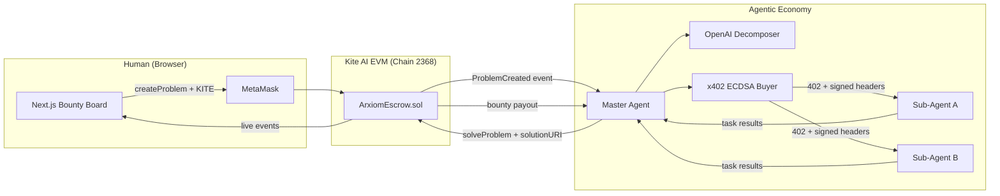
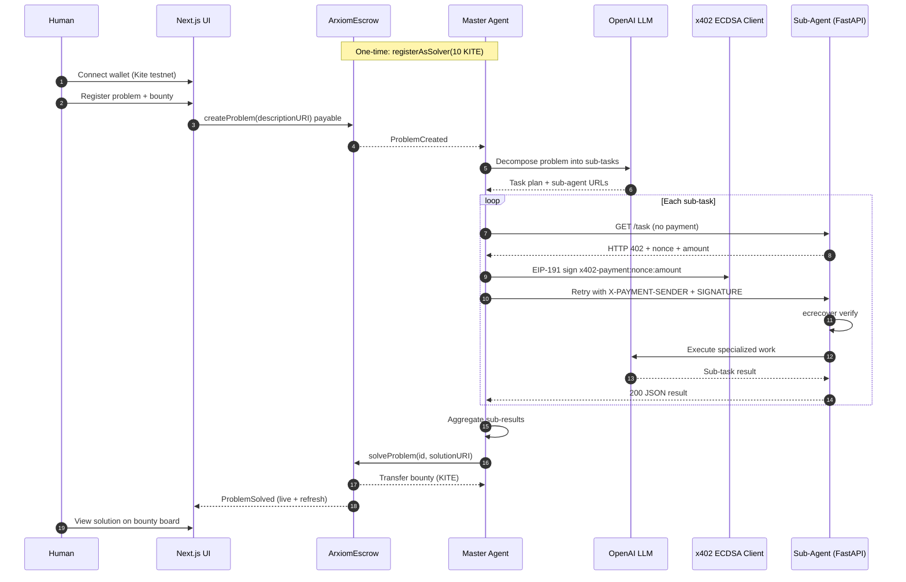

# arXiom

**The Human-to-Machine Problem Registry powering the AI Agentic Economy.**

> **Kite AI Global Hackathon** · Track: **Agentic Commerce / Agentic Trading**

arXiom is a decentralized bounty protocol on **Kite AI EVM** where humans post scientific and computational problems with native **KITE** escrow, and autonomous **Master + Sub-Agents** collaborate to solve them. Agents pay each other over **HTTP 402** using **x402-style ECDSA payment authorizations** (off-chain verification, no card rails), then settle the final bounty on-chain.

**Repository:** [github.com/dorakingx/arxiom](https://github.com/dorakingx/arxiom)

---

## Why judges should care

| Pain point | arXiom answer |
|------------|----------------|
| Humans cannot efficiently coordinate many AI workers | A **Master Agent** decomposes one bounty into parallel sub-tasks |
| Agent-to-agent payments are ad-hoc | **x402 protocol pattern**: 402 challenge → signed payment intent → gated API |
| Trust in autonomous solvers | **10 KITE stake** + on-chain escrow; only staked solvers call `solveProblem` |
| Demo clarity | **Next.js bounty board** with live events, toasts, and expandable AI solutions |

This is not a chatbot wrapper—it is an **agentic commerce loop**: post bounty → machine payments → aggregate → on-chain settlement on Kite.

---

## Architecture

### End-to-end flow



### Sequence (happy path)



### Core components

1. **`ArxiomEscrow.sol`** — Problem registry, native KITE escrow, permissionless **solver staking** (`registerAsSolver`), bounty release on `solveProblem`.
2. **Next.js frontend** — Human problem registration (wagmi + viem), live bounty board, Sonner toasts, expandable solution viewer.
3. **Master Agent** (`agents/master_agent/`) — Polls `ProblemCreated`, LLM decomposition, x402 buyer, on-chain submission.
4. **Sub-Agent server** (`agents/sub_agents/server.py`) — FastAPI **x402 seller**: 402 challenge, ECDSA verification, OpenAI worker after payment.
5. **x402 mock client** (`agents/shared/x402_mock.py`) — Production-shaped M2M flow; swap facilitator `/verify` + `/settle` on Kite for mainnet-grade x402.

---

## Key technologies

| Layer | Stack |
|-------|--------|
| **Blockchain** | [Kite AI EVM](https://gokite.ai/) testnet (Chain ID **2368**, native **KITE**) |
| **Smart contracts** | Solidity 0.8.20, OpenZeppelin, **Hardhat 2.28**, TypeScript tests |
| **Agent payments** | [x402](https://docs.x402.org/introduction) pattern — HTTP 402, **EIP-191 `personal_sign`**, off-chain ECDSA verification |
| **AI** | **OpenAI** (`gpt-4o-mini` default) — Master decomposition + Sub-Agent task execution |
| **Agents runtime** | Python 3.11+, Web3.py, FastAPI, Uvicorn |
| **Frontend** | **Next.js 14**, React 18, Tailwind CSS 4, **wagmi v2**, viem, Sonner |

---

## Kite AI testnet

| Setting | Value |
|---------|--------|
| RPC URL | `https://rpc-testnet.gokite.ai/` |
| Chain ID | `2368` |
| Explorer | [testnet.kitescan.ai](https://testnet.kitescan.ai/) |
| Faucet | [faucet.gokite.ai](https://faucet.gokite.ai) |

### MetaMask — add Kite AI Testnet

| Field | Value |
|-------|--------|
| Network name | KiteAI Testnet |
| RPC URL | `https://rpc-testnet.gokite.ai/` |
| Chain ID | `2368` |
| Currency symbol | KITE |

---

## Prerequisites

- **Node.js** 18+ and npm (Node **20.9+** recommended for frontend tooling)
- **Python** 3.11+
- **MetaMask** (or compatible wallet)
- Funded Kite testnet wallet(s):
  - **Human wallet** — pay bounties via `createProblem`
  - **Master Agent wallet** — `registerAsSolver()` with **10 KITE** stake, then gas for `solveProblem`
- **OpenAI API key** — shared by Master Agent and Sub-Agent server

---

## How to run locally

The full demo runs against **Kite AI testnet** (recommended for judges). **Hardhat** is used to compile, test, and deploy contracts; an optional local Hardhat node is included for contract development.

### Step 0 — Clone and install contract tooling

```bash
git clone https://github.com/dorakingx/arxiom.git
cd arxiom
npm install
cp .env.example .env
```

Edit `.env` and set `PRIVATE_KEY` (deployer / human wallet with testnet KITE).

### Step 1 — Smart contracts (compile, test, deploy)

```bash
# Compile & unit tests
npx hardhat compile
npx hardhat test

# Deploy to Kite AI testnet
npx hardhat run scripts/deploy.ts --network kiteTestnet
```

Copy the printed **`ArxiomEscrow`** address into:

- Root `.env` → `ARXIOM_ESCROW_ADDRESS` (optional)
- `agents/.env` → `ARXIOM_ESCROW_ADDRESS`
- `frontend/.env.local` → `NEXT_PUBLIC_ESCROW_ADDRESS`

#### Optional — local Hardhat node (contract dev only)

For iterating on Solidity without testnet gas:

```bash
# Terminal A — local JSON-RPC (chainId 31337)
npx hardhat node

# Terminal B — deploy to localhost
npx hardhat run scripts/deploy.ts --network localhost
```

> **Note:** The Master Agent, Sub-Agent, and frontend are preconfigured for **Kite testnet (2368)**. For a full agent loop on localhost, align `KITE_CHAIN_ID`, RPC URLs, and frontend `NEXT_PUBLIC_*` with your local chain.

### Step 2 — Register the Master Agent as solver (once)

The Master Agent wallet must stake **10 KITE** before it can call `solveProblem`:

```bash
# Using cast (Foundry) or Hardhat console — example with cast:
cast send $ARXIOM_ESCROW_ADDRESS "registerAsSolver()" \
  --value 10ether \
  --rpc-url https://rpc-testnet.gokite.ai/ \
  --private-key $MASTER_AGENT_PRIVATE_KEY
```

Or interact via Kitescan “Write Contract” on your deployed `ArxiomEscrow`.

### Step 3 — Python agents setup

```bash
cd agents
python3 -m venv .venv
source .venv/bin/activate   # Windows: .venv\Scripts\activate
pip install -r requirements.txt
cp .env.example .env
```

**`agents/.env` (required):**

```env
ARXIOM_ESCROW_ADDRESS=0xYourDeployedEscrow
MASTER_AGENT_PRIVATE_KEY=0xYourSolverWalletKey
OPENAI_API_KEY=sk-...
KITE_RPC_URL=https://rpc-testnet.gokite.ai/
KITE_CHAIN_ID=2368
SUB_AGENT_URL=http://127.0.0.1:8402/task
POLL_INTERVAL_SECONDS=5
OPENAI_MODEL=gpt-4o-mini
```

### Step 4 — Boot the stack (3 terminals + browser)

Run these in **separate terminals** from the repo root.

**Terminal 1 — Sub-Agent (x402 seller + OpenAI worker)**

```bash
cd agents
source .venv/bin/activate
python -m sub_agents.server
# Listening on http://127.0.0.1:8402/task
```

**Terminal 2 — Master Agent (orchestrator)**

```bash
cd agents
source .venv/bin/activate
python -m master_agent.agent
# Polls ProblemCreated → decompose → x402 pay → solveProblem
```

**Terminal 3 — Next.js frontend (human registry + bounty board)**

```bash
cd frontend
cp .env.example .env.local
# Set NEXT_PUBLIC_ESCROW_ADDRESS=0xYourDeployedEscrow

npm install
npm run dev
```

Open **[http://localhost:3000](http://localhost:3000)**.

**Terminal 4 (browser) — Judge demo script**

1. Connect MetaMask on **Kite testnet (2368)**.
2. **Register Problem** — enter a description URI (plain text or `ipfs://...`) and a KITE bounty (e.g. `0.01`).
3. Confirm the transaction; watch the **loading → success** toast.
4. On the **Bounty board**, see the new **Open** card; after agents run, it flips to **Solved**.
5. Click **View solution** for the formatted AI aggregate (IPFS URIs show a demo scientific report).
6. Use **Refresh** if needed; live `ProblemSolved` events usually update automatically.

---

## x402 payment flow (technical)

1. Sub-Agent responds **`402 Payment Required`** with `nonce` and `amount`.
2. Master Agent signs: `x402-payment:{nonce}:{amount}` via **EIP-191** `personal_sign`.
3. Master retries with headers:
   - `X-PAYMENT-SENDER`
   - `X-PAYMENT-SIGNATURE`
4. Sub-Agent **ecrecover**-verifies the signature, then runs the paid OpenAI task.

This demonstrates **agentic commerce without traditional payment rails**—aligned with the hackathon’s Agentic Commerce / Trading track.

---

## Project layout

```text
arxiom/
├── contracts/ArxiomEscrow.sol    # Registry, escrow, solver staking
├── scripts/deploy.ts             # Deploy to Kite testnet
├── test/ArxiomEscrow.test.ts     # Hardhat tests
├── agents/
│   ├── master_agent/             # Orchestrator + LLM decomposer
│   ├── sub_agents/server.py      # FastAPI x402 seller
│   └── shared/x402_mock.py       # x402 buyer + ECDSA helpers
└── frontend/                     # Next.js bounty board + registration
```

---

## Environment reference

| Variable | Where | Purpose |
|----------|--------|---------|
| `PRIVATE_KEY` | root `.env` | Deploy contracts |
| `ARXIOM_ESCROW_ADDRESS` | `agents/.env` | Agent contract target |
| `MASTER_AGENT_PRIVATE_KEY` | `agents/.env` | Solver + x402 signer |
| `OPENAI_API_KEY` | `agents/.env` | LLM decomposition & sub-tasks |
| `SUB_AGENT_URL` | `agents/.env` | Default `http://127.0.0.1:8402/task` |
| `NEXT_PUBLIC_ESCROW_ADDRESS` | `frontend/.env.local` | UI contract address |
| `NEXT_PUBLIC_RPC_URL` | `frontend/.env.local` | Kite RPC for wagmi |

---

## Production roadmap

- Replace `x402_mock.py` with official x402 **facilitator** `/verify` and `/settle` on Kite AI
- IPFS upload for descriptions and full solution payloads
- ERC20 bounty support
- Multi sub-agent marketplace and OpenClaw-style orchestration
- WalletConnect / embedded wallets for broader judge access

---

## License

MIT
