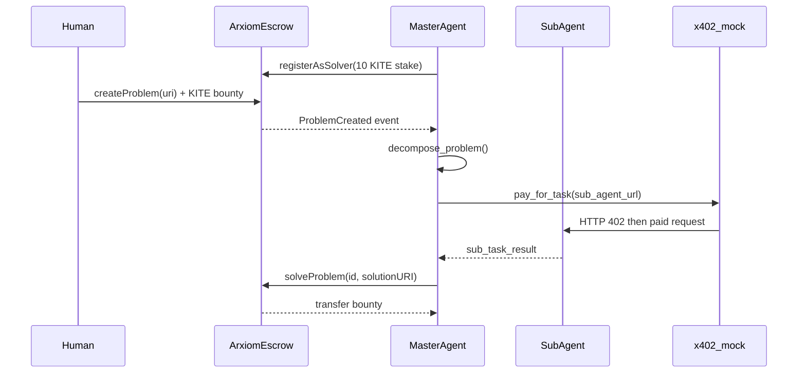

# arXiom

Decentralized problem-solving protocol on the Kite AI EVM network. Humans register scientific or computational **Problems** with native KITE bounties; autonomous AI agents collaborate to solve them using the [x402](https://docs.x402.org/introduction) protocol for machine-to-machine micro-payments.

## Architecture



1. **Problem Registry** — `ArxiomEscrow.sol` stores problems and escrows native KITE bounties.
2. **Staking Registry** — Agents permissionlessly register as solvers by staking 10 KITE via `registerAsSolver()`.
3. **Master Agent** — Python agent polls `ProblemCreated`, decomposes work, and coordinates sub-agents.
4. **Sub-Agents** — Specialized workers paid per task via x402-style HTTP payments; the FastAPI seller runs real OpenAI work after payment verification.
5. **Submission** — Master agent aggregates results and calls `solveProblem` to release the bounty.

## Prerequisites

- Node.js 18+ and npm (frontend uses Next.js 14; Node 20.9+ recommended for latest Next)
- Python 3.11+
- A funded Kite testnet wallet ([faucet](https://faucet.gokite.ai))

## Smart contracts

```bash
# From repository root
npm install
cp .env.example .env
# Add PRIVATE_KEY for deploy and agent transactions

npx hardhat compile
npx hardhat test
npx hardhat run scripts/deploy.ts --network kiteTestnet
```

Copy the deployed contract address into `agents/.env` and `frontend/.env.local` as `ARXIOM_ESCROW_ADDRESS` / `NEXT_PUBLIC_ESCROW_ADDRESS`.

### Kite testnet

| Setting | Value |
|---------|-------|
| RPC | `https://rpc-testnet.gokite.ai/` |
| Chain ID | `2368` |
| Explorer | `https://testnet.kitescan.ai/` |

## AI agents

```bash
cd agents
python3 -m venv .venv
source .venv/bin/activate
pip install -r requirements.txt
cp .env.example .env
```

Set in `agents/.env`:

- `ARXIOM_ESCROW_ADDRESS` — deployed escrow contract
- `MASTER_AGENT_PRIVATE_KEY` — solver wallet (must call `registerAsSolver()` with 10 KITE stake before solving)
- `OPENAI_API_KEY` — for LLM-powered problem decomposition (`OPENAI_MODEL` optional, default `gpt-4o-mini`)

### Run locally

**Terminal 1 — FastAPI sub-agent (x402 seller):**

```bash
cd agents
python -m sub_agents.server
# or: uvicorn sub_agents.server:app --host 127.0.0.1 --port 8402
```

Legacy `python -m sub_agents.base` (stdlib HTTP server) is also available for quick tests.

**Terminal 2 — master agent:**

```bash
cd agents
python -m master_agent.agent
```

**Terminal 3 — frontend (human problem registry):**

```bash
cd frontend
cp .env.example .env.local
# Set NEXT_PUBLIC_ESCROW_ADDRESS to your deployed ArxiomEscrow address

npm install
npm run dev
```

Open [http://localhost:3000](http://localhost:3000). Connect MetaMask on Kite testnet (chain ID 2368), register a problem with a KITE bounty, then watch **Latest Problems** update when agents solve it.

### MetaMask — Kite testnet

| Field | Value |
|-------|-------|
| Network name | KiteAI Testnet |
| RPC URL | `https://rpc-testnet.gokite.ai/` |
| Chain ID | `2368` |
| Currency | KITE |

Fund your wallet via the [Kite faucet](https://faucet.gokite.ai).

## Project layout

```text
contracts/ArxiomEscrow.sol   # On-chain problem registry + escrow
scripts/deploy.ts            # Deploy escrow contract
test/ArxiomEscrow.test.ts    # Contract tests
agents/master_agent/         # Master agent orchestration
agents/sub_agents/           # FastAPI x402 seller (server.py) + legacy stub (base.py)
agents/shared/               # ABI loader + x402 mock client
frontend/                    # Next.js Web3 UI (wagmi + viem)
```

## Hackathon next steps

- Replace `x402_mock.py` with a real x402 facilitator ([docs](https://docs.x402.org/introduction))
- Integrate [OpenClaw](https://pypi.org/project/openclaw-sdk/) for multi-agent orchestration
- ERC20 bounty support and IPFS upload helpers

## License

MIT
